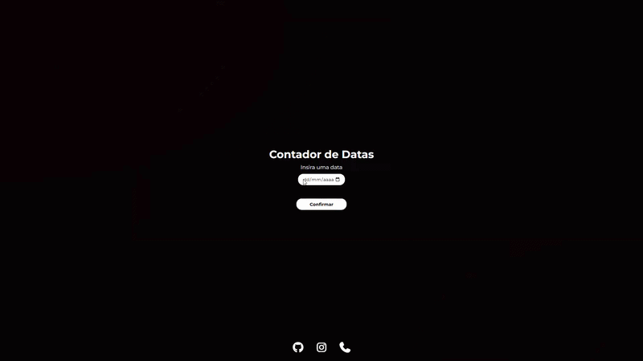

# 📅 Contador de Datas

> Uma aplicação web que calcula o tempo decorrido entre uma data escolhida pelo usuário e a data atual.

<div align="center">



[](https://tiago-neumann.github.io/02_contador_de_datas/) 


</div>

---

## 📌 Sobre o projeto

O **Contador de Datas** é uma aplicação desenvolvida com HTML, CSS e JavaScript que permite ao usuário informar uma data e descobrir quanto tempo se passou desde ela até o dia atual.

O resultado é apresentado de forma separada em:

* 📅 Anos
* 🗓️ Meses
* ☀️ Dias

O projeto foi desenvolvido principalmente para praticar **manipulação e cálculo de datas em JavaScript**, além da interação com elementos HTML.

---

## ✨ Funcionalidades

* 📅 Seleção de uma data através de um calendário;
* 🚫 Impede a seleção de datas futuras;
* ✅ Validação da data informada;
* 🧮 Cálculo de anos, meses e dias decorridos;
* 🔄 Possibilidade de voltar e inserir outra data;
* ⚡ Atualização dinâmica da interface;
* 📱 Interface adaptável a diferentes tamanhos de tela.

---

## 🖥️ Demonstração

<div align="center">


</div>

> 💡 Para utilizar esta seção, adicione uma captura de tela do projeto em `assets/preview.png`.

---

## 🛠️ Tecnologias utilizadas

| Tecnologia         | Utilização                          |
| ------------------ | ----------------------------------- |
| 🟧 **HTML5**       | Estrutura da aplicação              |
| 🟦 **CSS3**        | Estilização e layout                |
| 🟨 **JavaScript**  | Lógica da aplicação                 |
| 📅 **Date API**    | Manipulação e cálculo de datas      |
| ⭐ **Font Awesome** | Ícones da interface e redes sociais |

---

## ⚙️ Como funciona?

O fluxo da aplicação pode ser resumido da seguinte forma:

```text
Usuário escolhe uma data
        ↓
Data é validada
        ↓
Data futura?
   ↙           ↘
 Sim           Não
  ↓             ↓
Exibe erro    Calcula diferença
                ↓
        Anos / Meses / Dias
                ↓
        Resultado na tela
```

### 1. Seleção da data

O campo de data recebe automaticamente um limite máximo correspondente ao dia atual:

```javascript
const agora = new Date().toISOString().split('T')[0];

input_data.setAttribute('max', agora);
```

Dessa forma, o usuário não consegue selecionar diretamente uma data futura pelo calendário.

---

### 2. Validação

Antes de realizar o cálculo, a aplicação verifica se existe uma data válida e se ela não está no futuro:

```javascript
if (!valorInput || valorData > valorHoje) {
    erros.textContent = "Insira uma data válida";
}
```

Caso a informação seja válida, a tela de entrada é ocultada e o contador é apresentado.

---

### 3. Cálculo

A aplicação separa ano, mês e dia das duas datas:

```javascript
const [anoAgora, mesAgora, diaAgora] = ...
const [anoInserido, mesInserido, diaInserido] = ...
```

Depois, realiza a diferença entre os valores:

```javascript
anoFinal = anoAgora - anoInserido;
mesFinal = mesAgora - mesInserido;
diaFinal = diaAgora - diaInserido;
```

Como meses possuem diferentes quantidades de dias, são realizados ajustes quando o resultado de meses ou dias fica negativo.

---

## 🧠 Um dos desafios do projeto

Uma das partes mais interessantes foi lidar com a diferença entre meses.

Por exemplo, uma simples subtração pode produzir:

```text
2026/10/08
2025/12/20
```

A diferença direta seria:

```text
1 ano
-2 meses
-12 dias
```

Por isso, o programa precisa realizar ajustes para transformar esses valores em uma representação válida de anos, meses e dias.

Para os dias, o projeto utiliza o próprio objeto `Date` para descobrir quantos dias existem no mês anterior:

```javascript
const diasMes = new Date(anoFinal, mesFinal, 0).getDate();
```

Isso permite lidar com meses de 28, 29, 30 e 31 dias.

---

## 📂 Estrutura do projeto

```text
contador-de-datas/
│
├── index.html
├── style.css
├── main.js
│
└── assets/
    └── preview.png
```

---

## 🚀 Como executar

### 1. Clone o repositório

```bash
git clone https://github.com/SEU-USUARIO/SEU-REPOSITORIO.git
```

### 2. Acesse a pasta

```bash
cd SEU-REPOSITORIO
```

### 3. Abra o projeto

Você pode abrir diretamente o arquivo:

```text
index.html
```

Ou utilizar uma extensão como **Live Server** no VS Code.

Não existem dependências externas que precisem ser instaladas para executar a aplicação.

---

## 📚 O que aprendi

Este projeto foi desenvolvido principalmente para aprofundar meus conhecimentos em JavaScript.

Durante o desenvolvimento, pratiquei:

* `Date`;
* `getDate()`;
* `toISOString()`;
* `split()`;
* `map()`;
* `querySelector()`;
* `getElementById()`;
* `addEventListener()`;
* Manipulação do `textContent`;
* Validação de dados;
* Condicionais;
* Funções;
* Manipulação dinâmica do DOM.

Além disso, comecei a trabalhar com problemas que exigem um pouco mais de raciocínio lógico, especialmente no cálculo de diferenças entre datas.

---

## 🔮 Possíveis melhorias

* [ ] ⏱️ Mostrar também horas, minutos e segundos;
* [ ] 🎨 Adicionar animações durante a transição entre telas;
* [ ] 📊 Criar uma visualização mais detalhada do resultado;
* [ ] 🌙 Adicionar modo escuro;
* [ ] 📱 Melhorar a experiência em dispositivos móveis;
* [ ] 🧮 Permitir comparar duas datas escolhidas pelo usuário;
* [ ] 📋 Adicionar botão para copiar o resultado.

---

## 👨‍💻 Autor

Desenvolvido por **Tiago Neumann**.

<div align="center">

[](https://github.com/tiago-neumann)
[](https://www.instagram.com/_tiagoneumann/)

</div>

---

<div align="center">

⭐ Se você gostou do projeto, considere deixar uma estrela no repositório!

</div>
